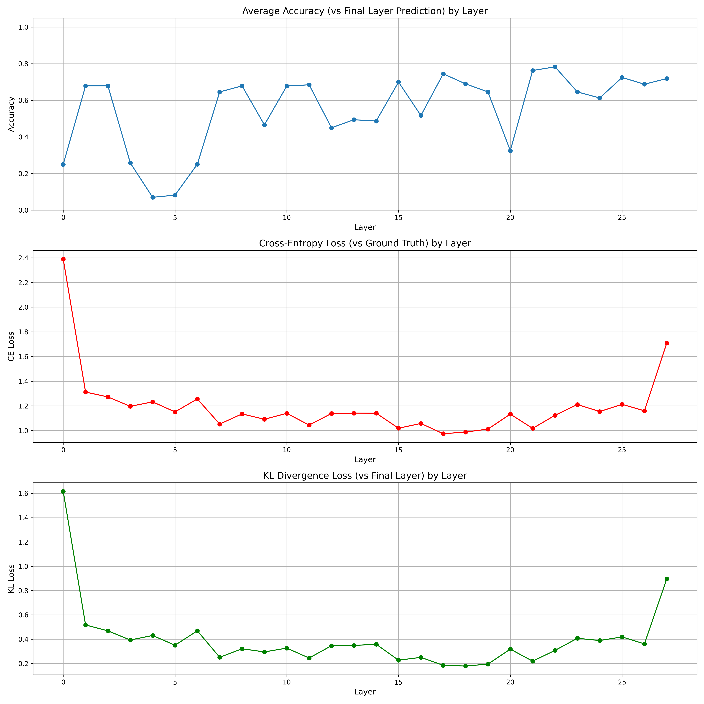
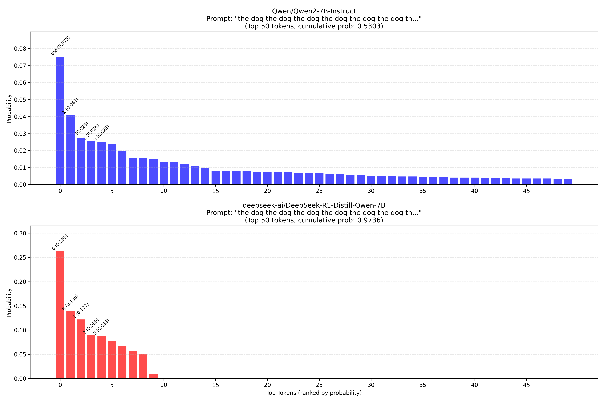

# Layer-Probing

Trains linear probes across transformer layers to track how information evolves through the residual stream — tested on Qwen2 and DeepSeek-R1-Distill models using the GSM8K reasoning dataset. Includes tools for visualizing probe performance, comparing base vs R1-tuned model behavior, and extracting residual stream activations.

## Models
- `Qwen/Qwen2-7B-Instruct` — baseline
- `deepseek-ai/DeepSeek-R1-Distill-Qwen-7B` — R1-tuned variant

## Dataset
GSM8K — grade school math reasoning benchmark used for probe training and evaluation.

## Results
**Probe Accuracy, CE Loss & KL Divergence by Layer**


**Token Probability Distributions (Top 50)**


> More plots (residual stream entropy — all tokens & last token) in the [`results/`](./results) folder.

## Installation

```bash
# Clone the repository
git clone https://github.com/nitesh-77/Layer-Probing.git
cd entropy_nanda

# Create and activate a virtual environment
python -m venv .venv
source .venv/bin/activate 

# Install dependencies
pip install -r requirements.txt
```

## Usage

### Information Level Identifier
```bash
python information_level_identifier.py --model_name "Qwen/Qwen2-7B-Instruct" --batch_size 64 --learning_rate 5e-4 --num_epochs 1
```

### Visualize Layers
```bash
python visualize_layers.py --probe_dir "./layer-probe-checkpoints" --model_name "deepseek-ai/DeepSeek-R1-Distill-Qwen-7B" --num_examples 100
```

### Model Comparison
```bash
python model_comparison.py --model1 "Qwen/Qwen2-7B-Instruct" --model2 "deepseek-ai/DeepSeek-R1-Distill-Qwen-7B"
```

### Residual Stream Visualization
```bash
python residual_stream_viz.py --model_name "Qwen/Qwen2-7B-Instruct" --num_examples 50
```

## Files

- `information_level_identifier.py`: Identifies information levels across layers using linear probes
- `visualize_layers.py`: Visualizes layer-wise information and performance of probes
- `residual_stream_viz.py`: Extracts and visualizes residual stream activations
- `model_comparison.py`: Compares different model outputs based on the same prompt
- `layer-probe-checkpoints/`: Trained probes for different layers
- `qwen2-gsm8k-checkpoints/`: Model checkpoints for GSM8K tasks
- `regular_probes/`: Standard linear probes without R1 tuning
- `r1_probes/`: Probe weights for the R1 tuned model

## Dataset

The project uses the GSM8K dataset for training and evaluation.

## Weights & Biases 

For experiment tracking:
```bash
wandb login
``` 
